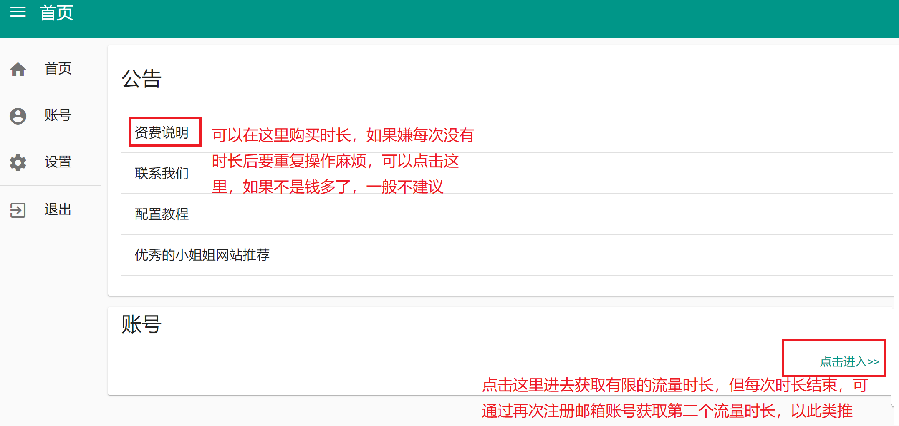
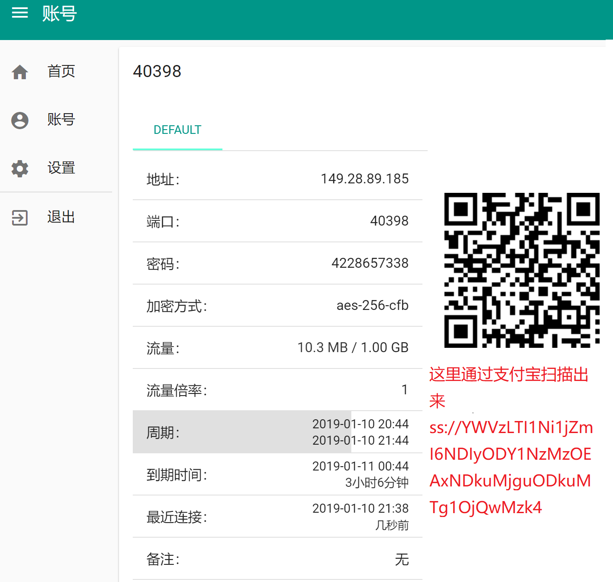
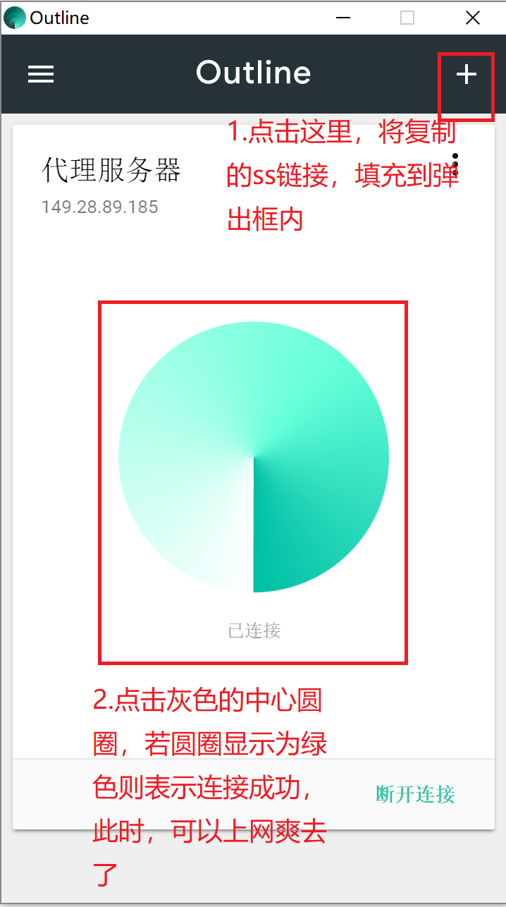

# 在PC端(windows)获取免费的梯子上墙 
废话不多说，直奔主题，本教程教你如何在PC端获取免费的梯子上墙。当然了自己搭建服务器或者购买账号服务也是允许的，毕竟对于花自己的钱为可爱的祖国贡献GDP这种举措我还是持有支持的态度。此外，如果想要自己搭建服务器的话，一定的计算机水平也是必不可少的条件。其实博主也有自己搭建服务器的想法，毕竟专车专送还是稳定得多的，打个小广告，若后续通过博主搭的服务器上墙还是需要你略尽绵薄之力。
在本文中主要教你两种获取免费梯子的方式，分别是通过lantern(蓝色的灯)和Outline。来这里的前提已经默许了你是有一定的计算机操作能力的。
### 第一把梯子--lantern(蓝色的灯)
1. [下载安装包文件](lantern/lantern-installer.exe)
2. 安装刚下载的应用
3. 直接点击桌面应用图标，默认开启梯子上墙服务并隐藏在后台执行，同时会打开相关网页
4. 打开已安装的google浏览器冲浪去吧，没有安装google浏览器则自行安装
 
注意事项：从网页上可以看到，默认的免费流量只有500M，少的可怜，不过不用担心，此时可以通过第二把梯子，不过第二把梯子也是有上网时长限制的，但可以通过临时邮箱这种工具获取不受限的上网时长,当然这种方式也较第一种方式麻烦，但想想是不受限的时长，这点麻烦也就可以不计了哈哈。
### 第二把梯子--Outline
1. [下载安装包文件](Outline/Outline.exe)
2. 安装刚下载的应用，此时安装好之后并不能向lantern直接打开使用，还需要获取临时流量账号和临时邮箱账号
3. [获取临时邮箱账号](https://getnada.com/),每次点击进去，都会获取到不同的临时邮箱账号，且这个邮箱账号一般只有10分钟使用时长，不要立即关闭当前网页，因为要接收后续的验证码

4. [获取临时流量账号](http://fuwu.airflyfree.com/home/index)，用刚才获取到的临时邮箱账号进行注册，验证码直接去原先的临时邮箱账号中获取。进来之后如下操作

5. 进去之后，获取二维码存储的信息，可以用支付宝扫描获取存储的信息，然后通过微信助手传送到PC端

6. 复制扫描出来的ss链接，并打开Outline客户端，并执行如下操作,登入Outline客户端，Outline过时的连接可以直接删掉

7. 打开已安装的google浏览器冲浪去吧，没有安装google浏览器则自行安装
 
注意事项：若时长不够用，可每次等时长用快完时，重复步骤3-6，若嫌麻烦可以花钱直接购买时长，毕竟有钱能使鬼推磨

------------------------------------华丽丽的分割线---------------------------------------------------- 
良心建议：一般建议先使用第二把梯子，不建议直接使用第一把梯子，毕竟流量有限，每个月只有500M